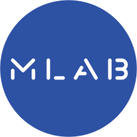
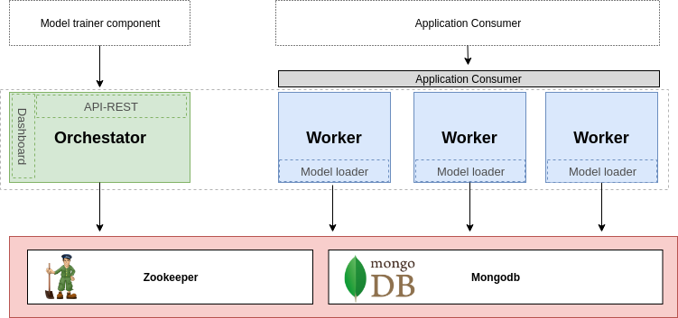

# MLAB framework

## Overview
Mlab is a framework tool designed for managing machine learning models in a production environment. This framework enables the developers to upload new machine learning models through a api-rest or in a manually way using the mlab dashboard. This lets the developers create full pipelines of training and release machine learning model . When a model is released in mlab architecture, we are able to active or deactive the model in a specific host in this way mlab allows us to create A/B test for the models. Once a model is released in a host, this can be consumed by the business applications through a web service.
Full documentation about web service is deployed by swagger as static documentation.


## Table of content
1. [Documentation](#documentation)
2. [Getting started](#getting-started)
3. [Architecture](#Architecture)
4. [Requirements](#requirements)
5. [Dashboard Orchestrator](#dashboard-orchestrator)
    1. [Install](#install)
    2. [Usage](#usage)
6. [Worker](#worker)
    1. [Install](#install)
    2. [Usage](#usage)
7. [Running with Docker](#running-with-docker)
8. [Status](#status)
9. [License](#license)

## Documentation
TODO

## Getting started
Is pretty simple, mlab have 2 main components, the workers and the orchestator/dashboard. One worker instance is as simple as webservice, who main goal is load machine learning models in memory and keep the sincronization with the orchestator. The orchestrator is in charge of controlling the workers machine learning algorithm loaded trough the dashboard or their REST-API.
## Architecture


## Requirements
```
sudo apt-get update
sudo apt-get install -y python3-pip virtualenvwrapper python3 nodejs npm 
sudo ln -s /usr/bin/nodejs /usr/bin/node
```
## Dashboard Orchestrator

### Install
```
mkvirtualenv --python=/usr/bin/python mlab_dashboard_env
cd dashboard/src/dashboard 
npm install 
./node_modules/bower/bin/bower install 
./node_modules/gulp/bin/gulp.js 
cd ${PROJECT_ROOT_DIRECTORY}/dashboard
#As mlab_dashboard_env virtual environment activated in the terminal session.
pip install .
```
### Usage

To run the server, please execute the following using mlab_dashboard_env.  
```
gunicorn -w 2 -b 0.0.0.0:5000 dashboard.app:app
```

Now we can open the dashboard, in the uri: http://localhost:5000/dashboard

## Worker

### Install
```
mkvirtualenv --python=/usr/bin/python mlab_worker_env
cd worker
#As mlab_worker_env virtual environment activated in the terminal session.
pip install .
```
### Usage

To run the server, please execute the following using mlab_dashboard_env.  
```
gunicorn -b 0.0.0.0:9090 -w 4 --config=python:worker.application.conf.gunicorn_conf worker.app:app
```

Now we can open the dashboard, in the uri: http://localhost:5000/dashboard

## Running with Docker

To run the server on a Docker container, please execute the following from the root directory:

```bash
# run docker-compose
docker-compose up --build
```
The dashboard service is running by default on http://localhost:5000/dashboard
The worker swagger documentation is running on port 9090.

## Status
This project is in the earliest phase of its development. Use it under your own responsibility.

## License 

    Mlab framework
    Copyright (C) 2018 Bluekiri BigData Team <bigdata@bluekiri.com>

    This program is free software: you can redistribute it and/or modify
    it under the terms of the GNU Affero General Public License as
    published by the Free Software Foundation, either version 3 of the
    License, or (at your option) any later version.

    This program is distributed in the hope that it will be useful,
    but WITHOUT ANY WARRANTY; without even the implied warranty of
    MERCHANTABILITY or FITNESS FOR A PARTICULAR PURPOSE.  See the
    GNU Affero General Public License for more details.

    You should have received a copy of the GNU Affero General Public License
    along with this program.  If not, see <https://www.gnu.org/licenses/>.
    
## Contributors
Thanks goes to these wonderful people:

<!-- ALL-CONTRIBUTORS-LIST:START - Do not remove or modify this section -->
<!-- prettier-ignore -->
| [<br /><sub><b>Cristófol Torrens</b></sub>](https://github.com/piffall)<br />[🤔](#ideas-planning "Ideas & Planning")  [🐛](#bugs-reports "Bugs reports") | [<br /><sub><b>David Martín</b></sub>](https://github.com/sukiweb)<br />[🤔](#ideas-planning "Ideas & Planning")  [🐛](#bugs-reports "Bugs reports") | [<br /><sub><b>Daniel bestard</b></sub>](https://www.linkedin.com/in/daniel-bestard-delgado-10984452/)<br />[🌍]("Documentation") [🤔](#ideas-planning "Ideas & Planning") | [<br /><sub><b>Joan Martín Miralles</b></sub>](https://www.linkedin.com/in/juanjosemartinmiralles/)<br /> [💻 ](#code "Code") |
| :---: | :---: | :---: | :---: | 
<!-- ALL-CONTRIBUTORS-LIST:END -->

 